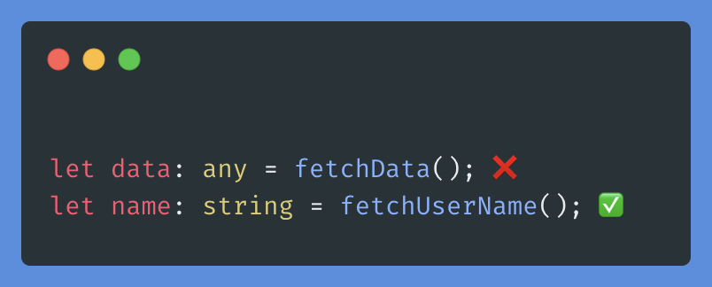

import { Tag } from "antd";

# TypeScript

TypeScript is a statically typed superset of JavaScript that adds optional static typing to the language, enabling developers to catch errors early during development and improve code maintainability in React applications. It enhances productivity by providing features like type checking, interfaces, and advanced tooling support, making codebases more robust and easier to scale.

### Best Practices

1.  **Type Annotations:** <Tag color="volcano">Safety</Tag> <Tag color="cyan"> Readability</Tag><br />
    Utilize type annotations wherever possible to provide clarity about the
    expected types of variables, parameters, and return values.

    ```typescript
    let age: number = 25;
    function greet(name: string): string {
      return `Hello, ${name}`;
    }
    ```

2.  **Avoid `any` type :**<Tag color="volcano">Safety</Tag> <Tag color="cyan"> Readability</Tag><br />
    Minimize the use of the `any` type as much as possible. Using `any` defeats
    the purpose of TypeScript's type checking. 

3.  **Interfaces Over Inline Types:**<Tag color="volcano">Safety</Tag> <br />
    Prefer defining interfaces or types over inline type annotations. This
    promotes reusability and readability.

        ```typescript
        interface User {
          name: string;
          age: number;
        }
        function getUserInfo(user: User): string {
          return `${user.name} is ${user.age} years old.`;
        }

4.  **Use `readonly`:**<Tag color="volcano">Safety</Tag> <br />

    Use the `readonly` modifier for properties whenever possible to prevent
    accidental modification.

    ```typescript
    interface Point {
      readonly x: number;
      readonly y: number;
    }
    let point: Point = { x: 10, y: 20 };
    point.x = 30; // Error: Cannot assign to 'x' because it is a readonly
    property;
    ```

5.  **Consistent Naming Conventions:** <Tag color="cyan">Readability</Tag> <br />

    Follow consistent naming conventions for variables, functions, interfaces,
    and types. Use camelCase for variables and functions, and PascalCase for
    types and interfaces.

         ```typescript
          interface Car {
          model: string;
          makeYear: number;
        }
        function calculateCarValue(car: Car): number {
          // Implementation
        }```

6.  **Use Enums:**

    When you have a fixed set of values, consider using enums to represent them instead of magic strings or numbers.

```typescript
enum Direction {
  Up,
  Down,
  Left,
  Right,
}
let playerDirection: Direction = Direction.Right;
```

7. **Avoid `null` and `undefined`:**
   <Tag color="volcano">Safety</Tag> <br />
   Whenever possible, avoid using `null` and `undefined`. Instead, use
   TypeScript's type system to represent nullable types explicitly using union
   types (`| null | undefined`).

```typescript
let username: string | null = getUsername(); // Allow null
```

8. **Use Union and Intersection Types:**
   Take advantage of TypeScript's powerful type system by using union and intersection
   types to model complex data structures.

```typescript
type Dog = {
  name: string;
  breed: string;
};
type Cat = {
  name: string;
  color: string;
};
type Pet = Dog | Cat;
function getPetDetails(pet: Pet): string {
  return `Name: ${pet.name}`;
}
```

9. **Use `as` for Type Assertions:**
    Use type assertions (`as` keyword) sparingly and only when necessary. Prefer type inference over explicit type annotations wherever possible.

```typescript
let userInput: unknown = getUserInput();
let userName = (userInput as string).toUpperCase();
```

10. **Avoid Type Assertion for Unknown Types:**
    If you're not sure about the type of a value, prefer using type guards (`typeof`, `instanceof`, etc.) over type assertions.

```typescript
if (typeof someValue === "string") {
  // use someValue as string
}
```

11. **Use `readonly` Array Types:**
    Use `readonly` array types instead of `Array` or `[]` for arrays that should not be mutated.

```typescript
if (typeof someValue === "string") {
  // use someValue as string
}
let numbers: readonly number[] = [1, 2, 3];
numbers.push(4); // Error: Property 'push' does not exist on type 'readonly number[]'
```

12. **Avoid `var`:**

Prefer using `let` or `const` over `var` for variable declarations to leverage block scoping.

### Ts Configs
 Options to be enabled on tsconfig.json to catch issues at compie time

1. **Use `noImplicitAny`:**
  Enforce explicit type annotations by enabling the `noImplicitAny` compiler option.

  ```json
  {
    "compilerOptions": {
      "noImplicitAny": true
    }
  }
  ```

2.  **Strict Mode:**<Tag color="volcano">Safety</Tag> <br />
    Enable TypeScripts strict mode (`strict` compiler option) to catch more
    potential errors at compiletime. Enable it in your `tsconfig.json`

    ```json
    {
      "compilerOptions": {
        "strict": true
      }
    }
    ```